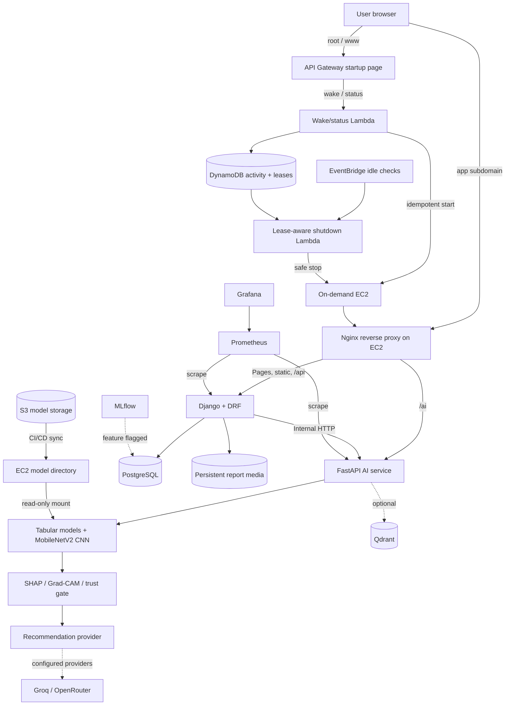

# MediMind AI

**AI-assisted healthcare decision support combining tabular risk models, chest X-ray analysis, medical report intelligence, explainable AI, and patient-facing health tools.**

[](https://www.python.org/)
[](https://www.djangoproject.com/)
[](https://fastapi.tiangolo.com/)
[](https://docs.docker.com/compose/)
[](https://aws.amazon.com/ec2/)
[](https://www.postgresql.org/)
[](https://nginx.org/)

**[Live Demo](https://medimind-ai.online)** · **[GitHub Repository](https://github.com/hammadAsher100/Medimind---Ai-powered-Healthcare-platform)**

> **Medical disclaimer:** MediMind AI is intended for educational, research, and decision-support purposes. Its predictions and AI-generated recommendations are not medical diagnoses and should not replace evaluation or advice from qualified healthcare professionals.

## Overview

MediMind brings common health-data workflows into one authenticated web application. Users can run structured disease-risk assessments, analyze chest X-rays, upload medical reports, review longitudinal health information, and receive human-readable educational guidance. Django owns the web experience and persisted patient data, while a separate FastAPI service runs machine-learning, image-analysis, explainability, and clinical-intelligence workloads.

The project is designed as an AI engineering and MLOps portfolio system—not as a clinically validated medical device.

## Features

- **Risk assessment:** diabetes, heart disease, chronic kidney disease, and stroke prediction flows with risk percentages and risk levels.
- **Chest X-ray analysis:** MobileNetV2-based NORMAL/PNEUMONIA classification, Grad-CAM visualization, and a trust gate that can abstain on unsuitable or low-confidence inputs.
- **Medical reports:** authenticated PDF, JPEG, and PNG upload; text extraction/OCR; analysis; comparison; persistent media storage; and protected retrieval.
- **Explainable AI:** optional SHAP factor contributions for tabular models and Grad-CAM heatmaps for the pneumonia classifier.
- **AI-assisted guidance:** Groq/OpenRouter provider abstraction converts structured results into cautious, readable educational text when configured, with deterministic fallback text where implemented.
- **Patient workspace:** authentication, profile and medical history, dashboard, health score, timeline, saved predictions, reports, and reviews.
- **Clinical intelligence:** patient-state summaries, longitudinal lab trends, medication-safety checks, counterfactual simulation, conflict detection, clinician feedback, and FHIR R4 export.
- **Knowledge and assistant tools:** multi-agent assistant routes plus optional Cohere embeddings and Qdrant-backed retrieval.
- **Operations:** Docker Compose, PostgreSQL, MLflow, Prometheus, Grafana, persistent volumes, service health checks, and HTTPS deployment on AWS EC2.

## Machine Learning Models

### Model summary

| Model | Task | Current implementation | Explainability | Output |
|---|---|---|---|---|
| Diabetes | Tabular binary risk prediction | Repository training selects among logistic regression, random forest, gradient boosting, and XGBoost; tracked run selected random forest | Optional SHAP | Risk percentage, Low/Medium/High level, binary prediction |
| Heart disease | Tabular binary risk prediction | Same candidate pipeline; tracked run selected XGBoost | Optional SHAP | Risk percentage, risk level, binary prediction |
| Chronic kidney disease | Tabular binary risk prediction | Same candidate pipeline; tracked run selected random forest | Optional SHAP | Risk percentage, risk level, binary prediction |
| Stroke | Tabular binary risk prediction | Same candidate pipeline; tracked run selected random forest | Optional SHAP | Risk percentage, risk level, binary prediction |
| Pneumonia | Chest X-ray binary classification | MobileNetV2 transfer learning with a sigmoid classification head | Grad-CAM and trust assessment | NORMAL/PNEUMONIA, probabilities, confidence, heatmap, trust status |

Production tabular artifacts are loaded from `${MODEL_BASE_DIR}/{disease}/` as `model.joblib`, `scaler.joblib`, and `feature_columns.json`; a SHAP explainer is loaded when present. The CNN is loaded from `CNN_PNEUMONIA_MODEL_PATH`, which defaults in production to `/opt/medimind/models/pneumonia/cnn_pneumonia.h5`. These large model files are synchronized from S3 onto EC2 and mounted read-only into FastAPI—they are not stored in Git or baked into application images.

<details>
<summary><strong>Diabetes risk prediction</strong></summary>

- **Purpose:** estimate binary diabetes risk from structured health measurements.
- **Inputs (8):** glucose, blood pressure, skin thickness, insulin, BMI, diabetes pedigree function, age, and pregnancies.
- **Feature engineering:** BMI category, age group, and glucose category.
- **Training preprocessing:** normalized column names, median numeric imputation, most-frequent categorical imputation, lower-cased categories, one-hot encoding, standard scaling, target encoding, and SMOTE when applicable.
- **Output:** class probability converted to a percentage, risk band, binary prediction, and optional explanation/recommendation fields.
- **Repository dataset note:** the tracked local training artifact was generated from the deterministic synthetic-data helper (1,000 rows, seed 42). A separate downloader/training script references the Pima Indians Diabetes dataset. Neither constitutes clinical validation.

</details>

<details>
<summary><strong>Heart disease risk prediction</strong></summary>

- **Purpose:** estimate binary heart-disease risk.
- **Inputs (13):** age, sex, chest-pain type, resting blood pressure, cholesterol, fasting blood sugar, resting ECG, maximum heart rate, exercise-induced angina, ST depression, ST slope, number of major vessels, and thalassemia category.
- **Feature engineering:** cholesterol ratio and maximum-heart-rate/age interaction.
- **Training preprocessing:** the shared imputation, encoding, scaling, class-balancing, stratified split, and five-fold model-selection pipeline.
- **Dataset:** the tracked training run uses the 303-row UCI Cleveland-format dataset included in the repository; multi-valued disease targets are converted to binary labels.
- **Output:** risk percentage, risk band, binary prediction, and optional explanation/recommendation fields.

</details>

<details>
<summary><strong>Chronic kidney disease risk prediction</strong></summary>

- **Purpose:** estimate binary chronic-kidney-disease risk.
- **Inputs (24):** age; blood pressure; specific gravity; albumin; sugar; red blood cells; pus cells and clumps; bacteria; random glucose; blood urea; serum creatinine; sodium; potassium; hemoglobin; packed-cell volume; white- and red-blood-cell counts; hypertension; diabetes mellitus; coronary artery disease; appetite; pedal edema; and anemia.
- **Feature engineering:** creatinine/blood-urea ratio and anemia flag.
- **Training preprocessing:** the shared imputation, encoding, scaling, class-balancing, split, and model-selection pipeline.
- **Repository dataset note:** the tracked local training artifact uses the deterministic synthetic-data helper (1,000 rows, seed 42). The public-data helper references a CKD dataset mirror, but the repository does not establish those downloaded artifacts as the deployed model.
- **Output:** risk percentage, risk band, binary prediction, and optional explanation/recommendation fields.

</details>

<details>
<summary><strong>Stroke risk prediction</strong></summary>

- **Purpose:** estimate binary stroke risk.
- **Inputs (10):** age, hypertension, heart disease, marital status, work type, residence type, average glucose, BMI, smoking status, and gender.
- **Feature engineering:** combined hypertension/heart-disease indicator.
- **Training preprocessing:** the shared imputation, encoding, scaling, class-balancing, split, and model-selection pipeline.
- **Repository dataset note:** the tracked local training artifact uses the deterministic synthetic-data helper (1,000 rows, seed 42). The public-data helper references the commonly used Fedesoriano stroke dataset mirror, but the deployed artifact provenance is not committed.
- **Output:** risk percentage, risk band, binary prediction, and optional explanation/recommendation fields.

</details>

<details>
<summary><strong>Pneumonia chest X-ray classifier</strong></summary>

- **Architecture:** ImageNet-pretrained MobileNetV2 (`include_top=False`), global average pooling, 35% dropout, and one sigmoid output. The training pipeline first trains the head, then can fine-tune the final 20 backbone layers while keeping batch-normalization layers frozen.
- **Input contract:** image decoded to three-channel RGB, resized to 224×224 with antialiasing, converted to `float32`, scaled to `[0, 1]`, and batched. The model contains the MobileNetV2 `[-1, 1]` rescaling layer so training and inference share the same contract.
- **Labels:** `NORMAL = 0`, `PNEUMONIA = 1`.
- **Training controls:** seed 42, stratified train/validation split, held-out test directory, train-only augmentation, class weighting, early stopping, learning-rate reduction, and checkpointing.
- **Thresholding:** the selected validation threshold is stored in the HDF5 model metadata and read at inference; `0.5` is the compatibility fallback.
- **Explainability and safety:** Grad-CAM highlights influential image regions. A trust assessment combines image quality, confidence, and dataset similarity and can return an abstention instead of a diagnostic-style result.
- **Dataset:** training expects a `chest_xray/{train,val,test}/{NORMAL,PNEUMONIA}` directory compatible with the established Chest X-Ray Pneumonia dataset layout. Dataset binaries and a pinned download source are not committed.
- **Metrics:** the training code calculates accuracy, precision, recall/sensitivity, specificity, F1, ROC AUC, and a confusion matrix, with acceptance gates emphasizing sensitivity. No final CNN evaluation report is tracked, so this README does not publish an unverified score.

</details>

### Tracked tabular evaluation artifacts

The following values come from the committed `training_metrics.json` files. They describe repository training runs—not clinical performance and not necessarily the externally managed production artifacts. Diabetes, kidney, and stroke used the synthetic local-data generator; heart used the UCI Cleveland-format file.

| Tracked run | Selected model | Accuracy | Precision | Recall | F1 | ROC AUC |
|---|---:|---:|---:|---:|---:|---:|
| Diabetes | Random forest | 0.7951 | 0.8014 | 0.7847 | 0.7930 | 0.8628 |
| Heart disease | XGBoost | 0.8030 | 0.8125 | 0.7879 | 0.8000 | 0.8430 |
| Kidney disease | Random forest | 0.8292 | 0.8651 | 0.7786 | 0.8195 | 0.8951 |
| Stroke | Random forest | 0.9335 | 0.9239 | 0.9444 | 0.9341 | 0.9865 |

## Explainable AI

MediMind separates four concepts that are easy to conflate:

1. **Prediction** — the model's binary class estimate.
2. **Risk percentage** — the positive-class probability expressed as a percentage and mapped to a risk band.
3. **Explanation** — optional SHAP contributions showing which submitted features pushed a tabular result higher or lower, or a Grad-CAM heatmap for an X-ray.
4. **Recommendation** — cautious educational text derived from the structured prediction and, when available, its explanatory factors.

For example, an explanation may identify glucose or BMI as influential submitted variables without claiming that either variable proves a diagnosis. Production currently sets `ENABLE_SHAP_EXPLANATIONS=False`, so tabular predictions remain fully usable when SHAP output is absent; the interface treats detailed factor analysis as optional rather than as a prediction requirement.

## AI Recommendation Layer

The FastAPI provider layer supports **Groq** as the primary configured LLM service and **OpenRouter** as a fallback. It receives structured context such as risk level, percentage, and optional factor contributions, then requests readable educational guidance. Provider calls include bounded retries, and supported flows retain safe static text when LLM use is disabled or unavailable.

Optional retrieval-augmented flows use **Cohere** embeddings and **Qdrant**. They can be disabled with feature flags, so they are shown as supporting capabilities rather than hard production dependencies. No credentials are stored in source control.

## System Architecture



The always-on API Gateway entry layer displays a branded startup page from Lambda while EC2 boots. The application stays on `app.medimind-ai.online`, directly behind Nginx, so long CPU-bound inference requests retain the existing 300-second timeout. All application services run in Docker on EC2; only Nginx publishes host ports. PostgreSQL, Qdrant, MLflow, Prometheus, Grafana, Django, and FastAPI remain on the Compose network.

## Technology Stack

| Area | Technologies verified in the repository |
|---|---|
| Frontend | Django templates, HTML, CSS, JavaScript, Chart.js |
| Web backend | Python 3.11, Django 5.2, Django REST Framework, Gunicorn |
| AI service | FastAPI, Uvicorn, Pydantic |
| ML / explainability | scikit-learn, XGBoost, TensorFlow/Keras, MobileNetV2, SHAP, Grad-CAM, imbalanced-learn |
| Document intelligence | pdfplumber, Pillow, Tesseract OCR |
| LLM / retrieval | Groq, OpenRouter HTTP integration, Cohere embeddings, Qdrant |
| Data | PostgreSQL in production, SQLite for the local launcher, persistent Docker media volume |
| MLOps / monitoring | MLflow, Prometheus, Grafana |
| Infrastructure | Docker Compose, Nginx, Let's Encrypt TLS, on-demand AWS EC2, API Gateway, Lambda, DynamoDB, EventBridge, Route 53, ACM |
| CI/CD | GitHub Actions, Docker Hub, AWS OIDC, Systems Manager deployment |

## Production Deployment

The public entry point remains **[https://medimind-ai.online](https://medimind-ai.online)**. An API Gateway custom domain and Lambda keep a lightweight startup page available when the application EC2 instance is stopped. The control API starts EC2 idempotently, polls a real readiness endpoint, and redirects to `https://app.medimind-ai.online` only after Django, PostgreSQL, FastAPI, and required model artifacts are ready.

Nginx terminates application TLS, redirects HTTP to HTTPS, serves collected static and uploaded media files, and proxies Django and FastAPI. Activity leases in DynamoDB prevent shutdown during authenticated work, uploads, predictions, deployments, or other mutating requests. EventBridge invokes a conservative idle evaluator, which stops only the configured instance after the idle and minimum-runtime conditions are satisfied. Let's Encrypt certificates, uploaded media, databases, monitoring data, and model files remain persistent outside disposable application containers.


The workflow preserves the server `.env`, certificate hierarchy, `/opt/medimind/models`, and named Docker volumes. It never rebuilds images on EC2 and never uses `docker compose down -v`. FastAPI is force-recreated after model synchronization so an updated TensorFlow model cannot remain cached in memory. When on-demand deployment is enabled, CI records the original power state, starts the instance through EC2 APIs, holds a deployment lease, and restores a previously stopped instance only if no visitor activity occurred meanwhile.

Infrastructure templates, rollout order, DNS cutover safeguards, certificate preparation, cost controls, and recovery procedures are documented in [`infrastructure/on-demand/README.md`](infrastructure/on-demand/README.md). The root/www DNS cutover is deliberately disabled by default so this architecture can be provisioned and tested without interrupting the current production endpoint.

## Project Structure

```text
.
├── .github/workflows/aws-deploy.yml     # Build, publish, and EC2 deployment workflow
├── infrastructure/on-demand/            # On-demand control plane, edge entry layer, startup UI
├── README.md
└── medimind-ai/
    ├── ai_service/                      # FastAPI app, routers, CNN registry, LLM and RAG
    │   └── ml_models/                   # Tabular training code and lightweight metadata
    ├── backend/django/                  # Django project, apps, templates, static assets
    ├── data/                            # Local development/training data layout
    ├── docker/                          # Django, FastAPI, and Nginx Dockerfiles
    ├── ml/cnn/                          # Current CNN architecture, preprocessing, training
    ├── monitoring/                      # Prometheus and Grafana configuration
    ├── nginx/nginx.conf                 # Production HTTPS reverse proxy
    ├── tests/                           # Cross-service and regression tests
    ├── docker-compose.yml               # Production service topology and persistence
    ├── run_local.py                     # SQLite-based local launcher
    └── train_all_models.py              # Public-data tabular training helper
```

## Local Development

### Prerequisites

- Git
- Python 3.11
- Docker Engine with Compose v2 for the full stack
- Tesseract OCR if local report-image extraction is required

### Clone and configure

```bash
git clone https://github.com/hammadAsher100/Medimind---Ai-powered-Healthcare-platform.git
cd Medimind---Ai-powered-Healthcare-platform/medimind-ai
cp .env.example .env
```

Replace every placeholder in `.env` with a local value. Never reuse or commit production secrets.

### Lightweight local launcher

The launcher uses SQLite and starts Django on port `8000` and FastAPI on port `8001`.

```bash
python -m venv .venv

# Linux/macOS
source .venv/bin/activate

# Windows PowerShell
# .\.venv\Scripts\Activate.ps1

python -m pip install -r requirements.txt
python run_local.py
```

Open <http://127.0.0.1:8000/login/>. Stop both development services with `Ctrl+C` in the launcher terminal.

### Full Docker Compose stack

The checked-in Compose file mirrors the on-demand production origin. Before starting Nginx locally, provide non-production certificates at the configured `/opt/medimind/certbot/conf/live/app.medimind-ai.online/` host path, or use a local-only Compose override to point the read-only certificate mount at your development certificates. The model mount similarly expects `/opt/medimind/models`.

```bash
docker compose config --quiet
docker compose up -d --build
docker compose ps
```

The gateway publishes ports `80` and `443`; internal services are intentionally not exposed directly. To stop the stack without deleting persistent data:

```bash
docker compose down
```

Do **not** add `-v` if you want PostgreSQL, Qdrant, Grafana, MLflow artifacts, static files, and uploaded media to survive.

## Environment Configuration

Use [`medimind-ai/.env.example`](medimind-ai/.env.example) as the source of variable names and safe examples.

| Variables | Purpose |
|---|---|
| `DJANGO_SECRET_KEY`, `DJANGO_DEBUG`, `DJANGO_ALLOWED_HOSTS` | Django secret, runtime mode, and accepted hosts |
| `SECURE_SSL_REDIRECT`, `SESSION_COOKIE_SECURE`, `CSRF_COOKIE_SECURE`, `SECURE_HSTS_SECONDS` | Production HTTPS and cookie policy |
| `CSRF_TRUSTED_ORIGINS`, `CORS_ALLOWED_ORIGINS` | Explicit browser origins |
| `POSTGRES_DB`, `POSTGRES_USER`, `POSTGRES_PASSWORD`, `POSTGRES_HOST`, `POSTGRES_PORT` | PostgreSQL connection |
| `FASTAPI_URL`, `DJANGO_INTERNAL_API_URL`, `DJANGO_SERVICE_TOKEN` | Internal service communication |
| `MODEL_BASE_DIR`, `CNN_PNEUMONIA_MODEL_PATH` | External tabular/CNN artifact locations |
| `GROQ_API_KEY`, `OPENROUTER_API_KEY`, `OPENROUTER_MODEL` | LLM provider configuration |
| `COHERE_API_KEY`, `QDRANT_HOST`, `QDRANT_PORT`, `QDRANT_COLLECTION` | Optional embeddings and vector search |
| `MLFLOW_TRACKING_URI`, `MLFLOW_ARTIFACT_ROOT` | Optional experiment tracking |
| `DISABLE_ML`, `DISABLE_CNN`, `DISABLE_QDRANT`, `DISABLE_MLFLOW` | Feature flags |
| `GRAFANA_ADMIN_USER`, `GRAFANA_ADMIN_PASSWORD` | Internal Grafana authentication |
| `ACTIVITY_TRACKING_ENABLED`, `ACTIVITY_TABLE_NAME`, `EC2_INSTANCE_ID`, `AWS_REGION` | On-demand EC2 activity and lease tracking |

The real `.env`, credentials, private keys, uploaded reports, and trained model files must remain untracked.

## API Overview

The browser normally uses authenticated Django routes. FastAPI is exposed through Nginx under `/ai/`; the prefix is stripped before the request reaches FastAPI.

### Representative Django routes

| Method | Route | Purpose |
|---|---|---|
| `POST` | `/api/auth/register/` | Create an account |
| `POST` | `/api/auth/login/` | Authenticate |
| `GET` | `/api/dashboard/` | Current user's dashboard data |
| `POST` | `/api/predictions/predict/<disease>/` | Validated risk prediction via FastAPI |
| `GET` | `/api/reports/` | List the authenticated user's reports |
| `POST` | `/api/reports/upload/` | Upload and analyze a PDF/JPEG/PNG report |
| `GET` | `/api/reports/<id>/` | Retrieve report metadata for its owner |
| `GET` | `/api/health-score/` | Current user's health-score data |
| `GET` | `/api/timeline/` | Current user's health timeline |

### Representative FastAPI routes

| Method | Production route | Purpose |
|---|---|---|
| `GET` | `/ai/health` | Service and CNN registry status |
| `GET` | `/ai/metrics` | Prometheus-format service metrics |
| `POST` | `/ai/predict/{disease}` | Diabetes, heart, kidney, or stroke inference |
| `GET` | `/ai/cnn/models` | Loaded CNN model status |
| `POST` | `/ai/cnn/predict/{model_id}` | Multipart X-ray inference and Grad-CAM result |
| `POST` | `/ai/analyze-report` | Medical report extraction and analysis |
| `POST` | `/ai/compare-reports` | Structured report comparison |
| `POST` | `/ai/agents/chat` | Multi-agent assistant request |
| `POST` | `/ai/lab/analyze-trend` | Longitudinal lab trend analysis |
| `POST` | `/ai/medication/safety-check` | Medication interaction/allergy checks |
| `POST` | `/ai/counterfactual/simulate` | Risk scenario simulation |
| `POST` | `/ai/fhir/export` | Build a FHIR R4 bundle |

Authentication, CSRF requirements, and payload schemas vary by endpoint. Inspect the Django URL modules, serializers, and FastAPI OpenAPI schema before integrating a client.

## Observability

Prometheus scrapes metrics from both Django and FastAPI every 15 seconds. FastAPI instrumentation includes standard HTTP metrics plus application counters for predictions and clinical-intelligence operations. Grafana is provisioned with Prometheus as a data source, while MLflow uses PostgreSQL and a persistent artifact volume when enabled. These administrative services are kept off the public Nginx surface.

## Security and Data Handling

- TLS 1.2/1.3 termination and HTTP-to-HTTPS redirection at Nginx.
- Forwarded HTTPS awareness in Django, secure cookies, configurable HSTS, trusted-origin parsing, CSRF protection, and Django authentication.
- Environment-driven secrets; `.env`, certificate keys, model binaries, and uploaded reports are excluded from Git.
- Only Nginx publishes host ports. Databases, observability tools, and application processes remain on the internal Docker network.
- Authenticated report download flow; `/media/` is an internal Nginx location rather than a public directory listing.
- A 50 MB Nginx request ceiling, a 20 MB application upload limit, server-side file validation, and persistent `django_media` storage for supported medical reports.
- Model files are mounted read-only from the EC2 host, and CI authenticates to AWS through OIDC rather than long-lived AWS keys in the workflow.

These controls improve the deployment posture but do not imply HIPAA, medical-device, or other regulatory compliance.

## Screenshots

No current application screenshots are versioned in the repository. UI screenshots can be added here later from non-sensitive demonstration data; real patient information must never be captured for documentation.

## Medical Disclaimer

> **MediMind AI is intended for educational, research, and decision-support purposes. Its predictions and AI-generated recommendations are not medical diagnoses and should not replace evaluation or advice from qualified healthcare professionals.**

Model outputs can be wrong, incomplete, or unsuitable for a particular person. Do not use MediMind for emergencies, autonomous treatment decisions, prescribing, or delaying professional care.
